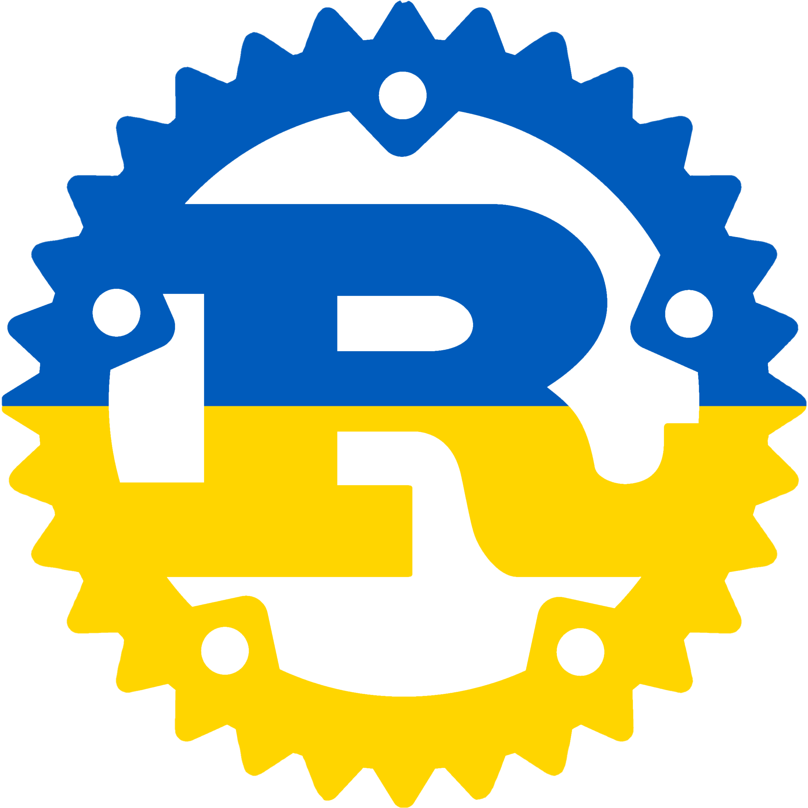

# іржа



Aren't you _втомився_ from writing Rust programs in English? Do you like saying
"лайно" and "дідько" a lot? Would you like to try something different, in an exotic and
funny-sounding language? Would you want to bring some Ukrainian touch to your
programs?

**irzha** (Ukrainian for _Rust_) is here to save your day, as it allows you to
write Rust programs in Ukrainian, using Ukrainian keywords, Ukrainian function names,
Ukrainian idioms.

This has been designed to be used as the official programming language to
develop the future Ukrainian sovereign operating system.

Here's an example of what can be achieved with irzha:

### `конвенція` та `реалізація` (a.k.a. `trait` and `impl`)

```rust
irzha::irzha! {
    вжити std::collections::Словник як Слов;

    конвенція КлючЗначення {
        функція записати(&власний, ключ: Строка, значення: Строка);
        функція отримати(&власний, ключ: Строка) -> Результат<Можливо<&Строка>, Строка>;
    }

    статичний змінний СЛОВНИК: Можливо<Слов<Строка, Строка>> = Нічого;

    структура Конкретний;

    реалізація КлючЗначення для Конкретний {
        функція записати(&власний, ключ: Строка, значення: Строка) {
            нехай слов = небезпечно {
                СЛОВНИК.отримати_або_вставити_із(Default::default)
            };
            слов.вставити(ключ, значення);
        }
        функція отримати(&власний, ключ: Строка) -> Результат<Можливо<&Строка>, Строка> {
            якщо нехай Дещо(слов) = небезпечно { СЛОВНИК.як_посилання() } {
                Файно(слов.отримати(&ключ))
            } інакше {
                Хиба("перевірте словник".до())
            }
        }
    }
}
```

### Alternative syntax

```rust
#[дозволити(недоступний_код)]
функція побічна() {
    лайно!("о ні!"); // for the true Ukrainian experience
    дідько!("ну що за люди");
    халепа!("корову вкрали"); // in SFW contexts
}
```

### Other examples

See the [examples](https://github.com/brokeyourbike/irzha/blob/main/examples/src/main.rs) to get a rough sense of the whole syntax.

## contributors

First of all, _вельми дякую_ for considering participating to this joke, the
Ukrainian government will thank you later! Feel free to throw in a few identifiers
here and there, and open a pull-request against the `main` branch.

Please don't introduce swear words, though.

## but _нащо_ would you do that

- _Задля забави_
- playing with raw proc macros
- making a bit of fun about programming languages that do this seriously, though I can see their utility

## Other languages

See the [original post](https://github.com/bnjbvr/rouille#other-languages) for a more up-to-date list.

## Дякую

[@bnjbvr](https://github.com/bnjbvr) for the idea, as well as the base repo

## Ліцензія

[WTFPL](https://github.com/brokeyourbike/irzha/blob/main/LICENSE)
